#  Git使用文档

**版本信息**

| 版本  | 作者   | 时间       | 备注     |
| ----- | ------ | ---------- | -------- |
| V 1.0 | 林艺斌 | 2021/09/05 | 创建文件 |

# 一、版本控制

**版本控制**

​			工程设计领域中使用版本控制管理工程蓝图的设计过程。在 IT 开发过程中也可以 使用版本控制思想管理代码的版本迭代。

**版本控制应该具备功能**

1. 协同修改：多人并行不悖的修改服务器端的同一个文件。
2. 数据备份：不仅保存目录和文件的当前状态，还能够保存每一个提交过的历史状态。
3. 版本管理：在保存每一个版本的文件信息的时候要做到不保存重复数据，以节约存储空间，提高运行效率。这方面 SVN 采用的是增量式管理的方式，而 Git 采取了文件系统快照的方式。
4. 权限控制：
   1. 对团队中参与开发的人员进行权限控制。
   2. 对团队外开发者贡献的代码进行审核——Git 独有。
5. 历史记录：
   1. 查看修改人、修改时间、修改内容、日志信息。
   2. 将本地文件恢复到某一个历史状态。
6. 分支管理：允许开发团队在工作过程中多条生产线同时推进任务，进一步提高效率。

# 二、Git简介

> 官网地址：https://git-scm.com/

**Git历史**

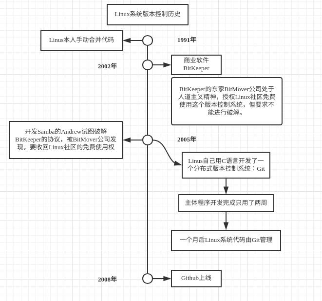

​																												**图2.1 Git简史** 

# 三、Git安装

## 3.1 Git下载安装

**Git下载**

1. Git官网下载，网站地址：https://git-scm.com/downloads

2.  如**图3.1**下载对应Git程序

   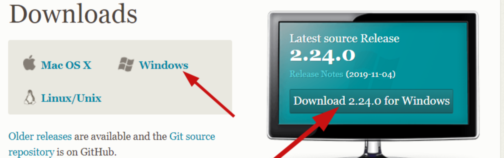

   ​																			**图3.1 Git下载**	

**Git安装**

​			默认安装即可。

## 3.2 Git结构

​			如**图3.3**是Git最核心的结构。

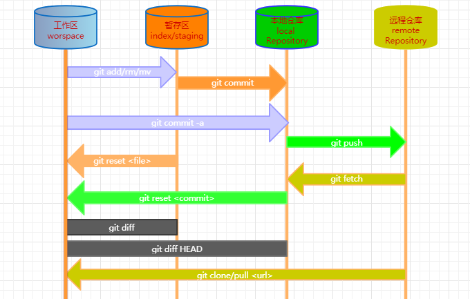

​																									**图3.2 Git结构和基本命令**

- 工作区(Workspace)：是电脑中实际的目录。
- 暂存区(Index)         ：类似于缓存区域，临时保存你的改动。
- 仓库区(Repository)：分为本地仓库和远程仓库。

## 3.3 本地库和远程库

**团队协作**

**团队外协作**

# 四、Git基本操作

**本地库初始化**

​			Git创建本地库有两种方式

- `$ git init`：将当前目录作为Git本地仓库使用
- `$ git init 目录名`：创建新目录，当作Git本地仓库使用

**设置签名**

​			设置签名的作用是：区分不同开发人员的身份 ，这里设置的签名和登录远程库(代码托管中心)的账号、密码没有任何关系。 

​			设置签名可以分为两种：

1. 当前仓库有效：设置完信息保存位置：`./.git/config 文件`，可以通过cat查看

   `$ git config --local user.name "name"`：设置用户名

   `$ git config --local user.email "email address"`：设置邮箱

   `$ cat ./.git/config`：查看配置结果

2. 全局有效设置：设置完信息保存位置：`~/.gitconfig`可以通过cat查看

   `$ git config --global user.name "name"`：设置用户名

   `$ git config --global user.email "email address"`：设置邮箱

   `$ cat ~/.gitconfig`：查看配置结果

​	

​			就近原则：项目级别优先于系统用户级别，二者都有时采用项目级别 的签名如果只有系统用户级别的签名，就以系统用户级别的签名为准 二者都没有不允许。

**状态查看**

​			`$ git status`：查看工作区、暂存区状态

**添加暂存区**

​			`$ git add 文件名` ：将工作区的“新建/修改”文件添加到暂存区

​			`$ git add *`：将所有“新建/修改”文件添加到暂存区

**提交本地库**

​			`$ git commit -m "注释" ` ：将暂存区的内容提交到本地库

**查看历史记录**

​			下面四种方式都可以查看历史提交记录，`$ git reflog`这个指令较为常用，后面的版本切换一般都是使用这个命名查看即可。

- `$ git log`：提交人，提交id，提交时间，提交描述等（多屏显示控制方式： 空格向下翻页 、b 向上翻页 、q 退出 ）

  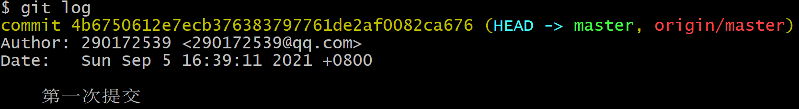

- `$ git log --pretty=oneline`：简化版：提交ID，提交描述

  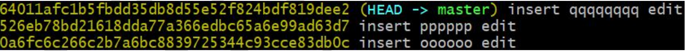

- `$ git log --oneline`：简化版：提交ID，提交描述

  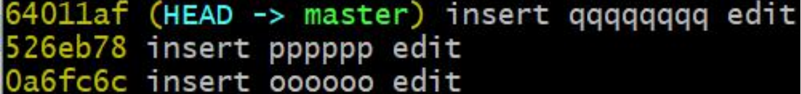

- `$ git reflog`：简化版：提交ID，提交描述

  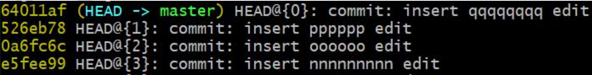

**历史版本前进后退**

​			Git会记录我们提交的各个信息，并由HEAD指针来指向最新的提交，版本前进和后退的本质就是移动指针来实现。

​			版本前进后退有三种方式可以实现

- `$ git reset --hard 7bf0e31`：基于索引值操作[推荐] （7bf0e31再图4.1中查看）
- `$ git reset --hard HEAD^`：使用^符号：只能后退 （一个^表示后退一步，n 个表示后退 n 步）
- `$ git reset --hard HEAD~n `：使用~符号：只能后退 （表示后退 n 步 ）

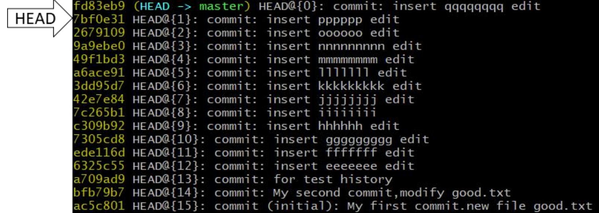

​																												**图4.1 测试提交多个版本记录**

**reset 命令的3个参数**

- `--soft 参数`  ： 仅仅在本地库移动 HEAD 指针
- `--mixed 参数`：在本地库移动 HEAD 指针，重置暂存区
- `--hard 参数`  ：在本地库移动 HEAD 指针、重置暂存区、重置工作区

**删除文件找回**

​			找回文件分两种情况：

- `$ git reset --hard [指针位置] `：删除操作已经提交到本地库

- `$ git reset --hard HEAD `：删除操作尚未提交到本地库

  HEAD就指向是本地库的当前提交版本位置，上面的操作，就是将工作区和暂存区与本地库同步。

**比较文件差异**	

​				对比文件差异的方式有三种：

- `$ git diff [文件名]`：将工作区中的文件和暂存区进行比较
- `$ git diff [本地库中历史版本] [文件名]`：将工作区中的文件和本地库历史记录比较
- `$ git diff`：不带文件名比较多个文件

# 五、分支管理

## 5.1 分支概述

**什么是分支？**

​			在版本控制过程中，使用多条线同时推进多个任务。 

**分支的好处**

1. 同时并行推进多个功能开发，提高开发效率
2. 各个分支在开发过程中，如果某一个分支开发失败，不会对其他分支有任何影响。失败的分支删除重新开始即可。 

## 5.2 分支操作

**创建分支**

- `git branch [分支名] `

**删除分支**

- `git branch -d [分支名]`

**查看分支**

- `git branch`或者`git branch -v`

**切换分支**

- `git checkout [分支名] `

**创建并立即切换**

- `git checkout -b [分支名]`

**合并分支**

​			合并分支需要有两步操作

1. `git checkout [被合并分支名]`：切换到接受修改的分支（要被合并，增加新内容的分支）
2. `git merge [要合并过来的分支名]`：合并

**解决冲突**

​			当两个要合并的分支同时修改到同一个文件的同一行时，执行合并操作的时候Git不知道到底保留哪一行是正确的，这个时候就会产生合并冲突，需要手动去修改。

​			当执行合并操作并且产生合并冲突时，需要手动去修改。一般步骤如下（加入冲突表现如**图5.1**所示）

1. 编辑文件，删除特殊符号

2. 把文件修改到满意的程度，保存退出

3. `git add [文件名] `

4. `git commit -m "日志信息"`：（此时 commit 一定不能带具体文件名）

   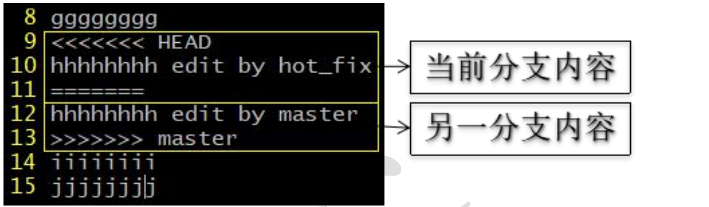

​																**图5.1 冲突表现**

# 六、Github

# 6.1 远程库创建

**Github注册**

​		使用GitHbu需要注册一个账号，GitHub的地址：https://github.com/，首页就是注册选项，注册按照提示进行注册就好了， 这里就不过多描述。

**创建远程库**

​		注册完之后进行登录，然后就可以开始创建远程库了，创建远程库步骤如下

1. New repository

   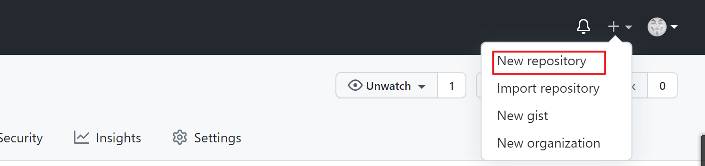

   ​																					**图6.1 创建远程库**

2. 填写相关信息

   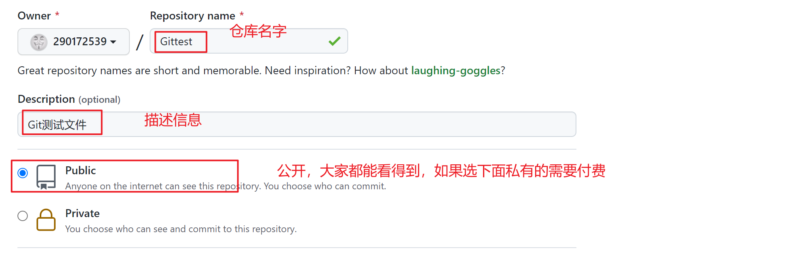

   ​																				**图6.2 远程库相关信息填写**

3. 点击创建即可得到一个远程库

   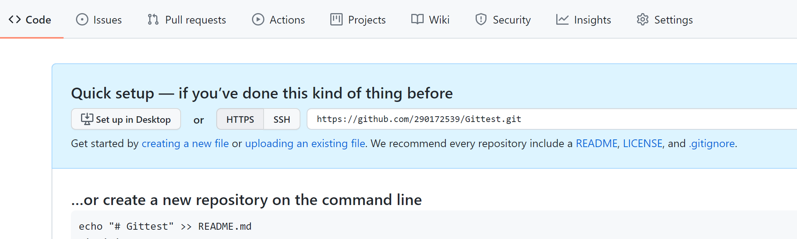

   ​																	**图6.3 创建远程库结束**						

## 6.2 连接远程库

**远程库别名**

​			如**图6.3**所示有个HTTPS地址`https://github.com/290172539/Gittest.git`，后续本地库与远程库关联都是通过这个地址，每次输入地址会相当麻烦，所以可以再本地先创建一个别名：

- `git remote -v`： 查看当前所有远程地址别名

- `git remote add [别名] [远程地址]`：创建别名

  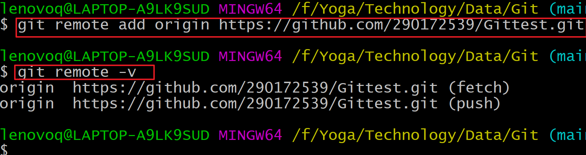

**本地库推送到远程库**

- `git push [别名] [分支名]`

  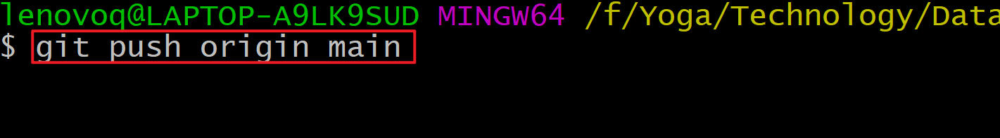

**克隆远程库**

​			当没有创建本地库的时候也可以通过克隆命令直接把远程库克隆下来，然后回自动再本地创建一个本地库，来关联远程库。

- `git clone [远程地址]`

  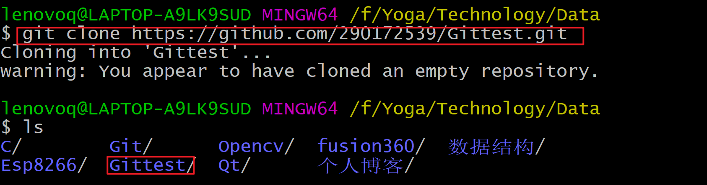

​			`git clone`命令会做三个动作：

1. 完整的把远程库下载到本地 
2. 创建 origin 远程地址别名
3. 初始化本地库

**拉取远程库到本地**

- `git pull [远程库地址别名] [远程分支名]`

  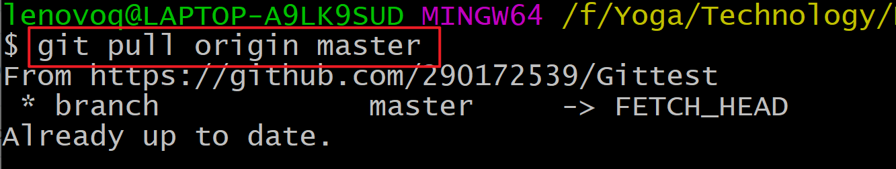

​		pull=fetch+merge ：pull抓取的命令 =下载fetch + 合并merge两个命令所以`git pull [远程库地址别名] [远程分支名] `等价于下面两个命令：

1. `git fetch [远程库地址别名] [远程分支名] `

   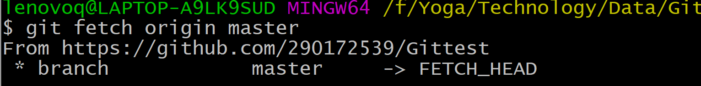

   查看抓取结果

   `git checkout origin/master`：切换到这个分支就可以查看抓取的内容了

2. `git merge [远程库地址别名/远程分支名]` ：一般确认抓取的没问题就可以合并到主分支

   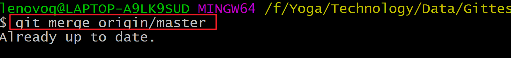

# 七、Git项目分支设计

# 八、GitLab

