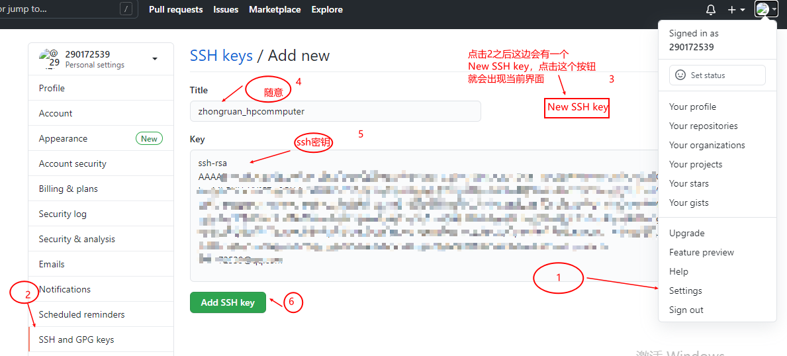
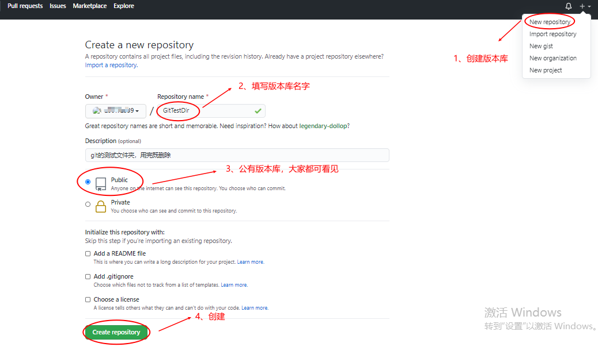
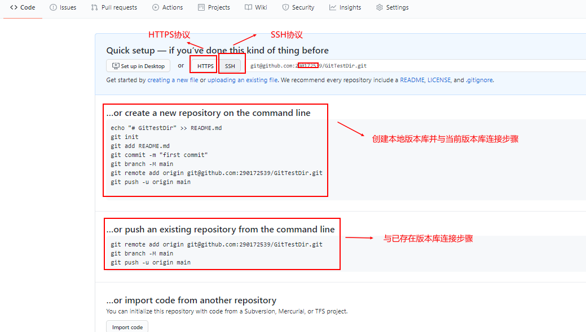
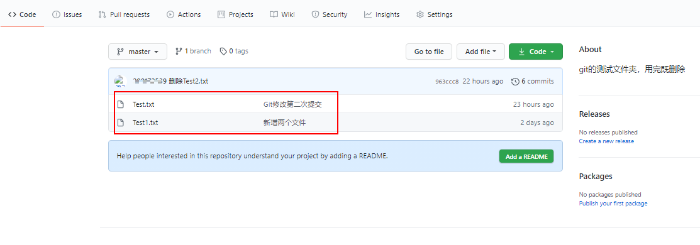
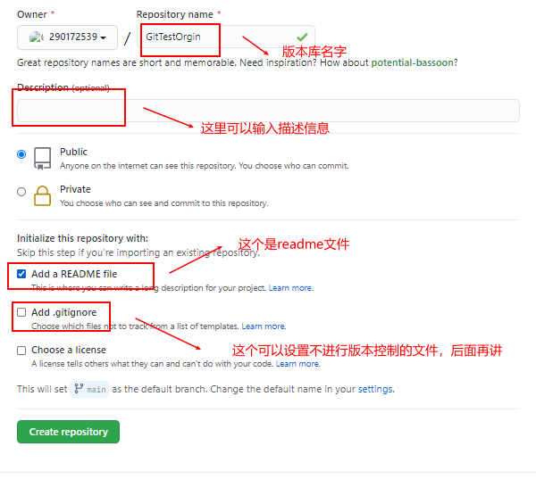
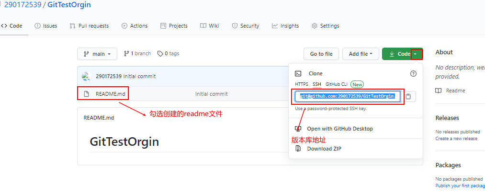

# 									Git讲义1.0

​                                                                               **版本信息**

| 版本  |  作者  |         时间          |      备注      |
| :---: | :----: | :-------------------: | :------------: |
| V 1.0 | 林艺斌 | 2020/01/06~2020/01/07 | 第一版（整理） |
|       |        |                       |                |


# 0 Git命令集合

1、新建Git版本库

> 在`当前目录`新建一个Git代码库
>
> `$ git init`
>
> 1. 
> 2. \# 新建一个目录，将其初始化为Git代码库
> 3. $ git init [project-name]
> 4. 
> 5. \# 下载一个项目和它的整个代码历史
> 6. ***\*$\** \**git \*\*clone\*\* [url]\****

**1、本地相关命令**

创建本地版本库

> `$ git init`

查看当前git状态（提交，修改，添加，远程等）

> `$ git status`

添加文件到暂存区

> `$ git add Text.txt` 

提交文件到版本库

> `$ git commit -m "Text.txt文件新增“版本回退测试“字符串"` 

查看提交记录（提交人，提交id，提交时间，提交描述等）

> `$ git log`

查看提交记录（简化版：提交ID，提交描述）

> `$ git log --pretty=oneline`

查看历史提交记录（`版本回退的时候好用`）

> `$ git reflog`

版本回退到当前版本的上一个版本

> `$ git reset --hard HEAD^`

版本回退到指定版本（版本ID为`e77db....`，版本id不用写全）

> `$ git reset --hard e77db`

撤销还未添加到暂存器的修改

> `$ git checkout -- Test.txt`

撤销已提交到暂存器的修改

> `$ git reset HEAD Test.txt`			撤销暂存区的提交
>
> `$ git checkout -- Test.txt`		 撤销文件修改

删除版本库和本地文件（如事先已使用rm删除本地文件，`rm Test.txt`；也是用下面两条命令删除版本库文件）

> `$ git rm Test.txt`
>
> `$ git commit -m "删除Test2.txt"`


**2、远程提交命令**


# 1 Git概述

 **1、什么是Git？** 

-  Git是目前世界上最先进的分布式版本控制系统 


# 2 Git安装

## 2.1 Linux安装Git

**1、查看是否安装Git**

- 在终端输入：`$ git -v`


**2、安装Git**

- 在终端使用命令安装（安装方法一）

  > Deian或者Ubuntu系统
  >
  > `$  sudo apt-get install git `
  >
  > 老一点的Deian或者Ubuntu系统
  >
  > `$  sudo apt-get install git-core `

- 下载安装包安装（安装方法二）

  > -  先从Git官网下载源码，然后解压。 
  > - 进入解压目录;
  > - 在终端输入：`$ ./config`
  > - 在终端输入：`$ make`
  > - 在终端输入：`$ sudo make install`

## 2.2 Windos安装Git


## 2.3 Mac OS安装Git


# 3 Git创建版本库

**1、什么是版本库呢？**

版本库又名仓库，英文名**repository**，你可以简单理解成一个目录，这个目录里面的所有文件都可以被Git管理起来，每个文件的修改、删除，Git都能跟踪，以便任何时刻都可以追踪历史，或者在将来某个时刻可以“还原”。

2、版本库结构


**2、创建版本库**

创建一个版本库非常简单，步骤如下：

```shell
$ mkdir GitTestDir		/* 创建文件 */
$ cd GitTestDir			/* 进入文件目录 */
$ git init				/* 创建版本库 */
Initialized empty Git repository in E:/gittest/GitTestDir/.git/		/* 终端打印提示信息 */
```

- 总结：

  > - `$`：符号表示终端的意思，不属于命令的一部分，不需要输入。
  > - `git init`：创建一个版本库，创建完成会在当前文件夹多一个.git文件夹。
  > -  `.git`目录：是Git用来跟踪管理版本库的，没事千万不要手动修改这个目录里面的文件，不然改乱了，就把Git仓库给破坏了。 
  > - `.`号开头的是隐藏文件，正常情况看不见这个文件夹，linux使用命令`$ls -al`就能看到，windos设置一下显示隐藏文件。


**3、Git简单版本管理**

下面开始创建文件，体验一下Git版本管理的优势

- 创建文件Test.txt，往文件里面增加下面内容

  > hello world

- 将Test.txt提交到Git 暂存区 （index）

  > `$ git add Text.txt` 

- 查看当前版本库状态，会显示当前有数据在暂存区，还未提交（`不是必要步骤，可不做`）

  > `$ git status`

- 将Git暂存区文件提交到版本库当中

  > `$ git commit -m "第一提交"` 

- 查看提交日志,会显示当前有一个版本已经提交（`不是必要步骤，可不做`）

  > `$ git log` 

- 再创建两个文件Test1.txt，Test2.txt内容任意，然后将新建文件提交到版本库中

  > `$ git add Text1.txt Text2.txt ` 
  >
  > `$ git commit -m "新增两个文件"` 

# 4 Git版本管理

## 4.1 版本回退与恢复

### 1、版本回退

- 在上面的基础上修改Test.txt内容如下

  > hello world
  > 版本回退测试

- 提交到版本库中

  > `$ git add Text.txt ` 
  >
  > `$ git commit -m "Text.txt文件新增“版本回退测试“字符串"` 

- 使用log命令查看，则会显示当前提交的三个版本

  > `$ git log`
  >
  > commit 0162967da579e509d4333db2ec9c8796aad4068f (HEAD -> master)
  > Author: linyibin <290172539@qq.com>
  > Date:   Thu Jan 7 19:30:19 2021 +0800
  >
  >     Text.txt文件新增“版本回退测试“字符串
  >
  > commit e77db3be5804c668d3e43f1fb0864eb54f256350
  > Author: linyibin <290172539@qq.com>
  > Date:   Thu Jan 7 19:26:44 2021 +0800
  >
  >     新增两个文件
  >
  > commit 4b81b30896bb02387828546671079a7c67693593
  > Author: linyibin <290172539@qq.com>
  > Date:   Thu Jan 7 19:01:55 2021 +0800
  >
  >     第一次提交

- 可以给log命令增加参数，简化输出信息(类是`016296...`这个是版本号，随机生成，每次提交都不一样)

  > `$ git log --pretty=oneline`
  >
  > 0162967da579e509d4333db2ec9c8796aad4068f (HEAD -> master) Text.txt文件新增“版本
  > 回退测试“字符串
  > e77db3be5804c668d3e43f1fb0864eb54f256350 新增两个文件
  > 4b81b30896bb02387828546671079a7c67693593 第一次提交

- 回退到上一个版本，(版本回退是靠HEAD指针指向之前的位置实现的）

  回退方法一：HEAD^表示上一个版本，HEAD^^表示上上个版本

  >  `$ git reset --hard HEAD^`
  >
  > HEAD is now at e77db3b 新增两个文件

  回退方法二：除了方法1，还可以使用版本号来实现版本回退（`注意版本号可以不用写全`）

  > `$ git reset --hard e77db`
  >
  > HEAD is now at e77db3b 新增两个文件

- 查看Test.txt文件，会发现里面的内容又变成

  > hello world

  说明版本回退成功

### 2、恢复回退之前版本

- 查看到回退之前的版本

  > `$ git log --pretty=oneline`
  > e77db3be5804c668d3e43f1fb0864eb54f256350 (HEAD -> master) 新增两个文件
  > 4b81b30896bb02387828546671079a7c67693593 第一次提交

  按之前方式查找，找不到回退前的版本号，可使用下面命令查看

  > `$ git reflog`
  > e77db3b (HEAD -> master) HEAD@{0}: reset: moving to e77db
  > e77db3b (HEAD -> master) HEAD@{1}: reset: moving to HEAD^
  > 0162967 HEAD@{2}: commit: Text.txt文件新增“版本回退测试“字符串
  > e77db3b (HEAD -> master) HEAD@{3}: commit: 新增两个文件
  > 4b81b30 HEAD@{4}: commit (initial): 第一次提交

- 恢复回退前版本

  > `$ git reset --hard 0162967`
  > HEAD is now at 0162967 Text.txt文件新增“版本回退测试“字符串

- 查看Test.txt文件，会发现里面的内容又变成

  > hello world
  >
  > 版本回退测试


## 4.2 Git管理修改

Git版本管理本质上管理的是文件的内容变化（修改）。

### **1、文件多次修改与提交**

- 在上面的基础上修改Test.txt内容如下

  > hello world
  >
  > 版本回退测试
  >
  > Git修改测试

- 将文件更新到暂存区

  > `$ git add Test.txt`

- 查看当前状态，可看到暂存区里面有上面添加的文件

  > `$ git status`
  > On branch master
  > Changes to be committed:
  >   (use "git restore --staged <file>..." to unstage)
  >         modified:   Test.txt

  不要commit提交！！！

- 再次修改Test.txt内容如下

  > hello world
  >
  > 版本回退测试
  >
  > Git修改测试
  >
  > Git修改第二次修改测试

- 查看当前状态

  > `$ git status`
  > On branch master
  > Changes to be committed:
  >   (use "git restore --staged <file>..." to unstage)
  >         modified:   Test.txt
  >
  > Changes not staged for commit:
  >   (use "git add <file>..." to update what will be committed)
  >   (use "git restore <file>..." to discard changes in working directory)
  >         modified:   Test.txt

  能看到当前状态有一次修改和一次提交

- 使用commit提交版本库，再查看一下状态

  > `$ git commit -m "Git修改测试第一次提交"`
  > [master 2b3f263] Git修改测试第一次提交
  >  1 file changed, 2 insertions(+), 1 deletion(-)
  >
  > `$ git status`
  > On branch master
  > Changes not staged for commit:
  >   (use "git add <file>..." to update what will be committed)
  >   (use "git restore <file>..." to discard changes in working directory)
  >         modified:   Test.txt
  >
  > no changes added to commit (use "git add" and/or "git commit -a")

  第二次修改并没有被提交上去。

- 提交第二次修改

  > `$ git add Test.txt`
  >
  > `$ git commit -m "Git修改测试第二次提交"`

  这样子，版本库就与我们当前工作区同步了

  

### 2、撤销修改

- 在上面的基础上修改Test.txt内容如下

  > hello world
  >
  > 版本回退测试
  >
  > Git修改测试
  >
  > Git修改第二次修改测试
  >
  > Git撤销测试

- 撤销修改，撤销修改有两种情况

  - 撤销工作区修改，（还未将上面修改add到暂存区）

    > `$ git checkout -- Test.txt`

    暂存区没有内容，撤销修改就回到和`版本库`一模一样的状态； 

    暂存区有未提交内容，又对文件进行修改， 撤销修改就回到`添加到暂存区后`的状态。

  - 撤销暂存区修改，（已将上面修改add到暂存区）

    > `$ git status`
    > On branch master
    > Changes to be committed:
    >   (use "git restore --staged <file>..." to unstage)
    >         modified:   Test.txt
    >
    > `$ git reset HEAD Test.txt`
    >
    > `$ git checkout -- Test.txt`

  

   `git checkout -- file`命令中的`--`很重要，没有`--`，就变成了“切换到另一个分支”的命令，我们在后面的分支管理中会再次遇到`git checkout`命令。 

### 3、删除文件

- 删除文件

  > `$ git rm Test2.txt`

- 提交到版本库

  > `$ git commit -m "删除Test2.txt"`
  > [master 963ccc8] 删除Test2.txt
  >  1 file changed, 1 deletion(-)
  >  delete mode 100644 Test2.txt

  如果你事先已经使用`$ rm Test2.txt`将文件删除，也是使用上面两个步骤。


# 5 Git远程仓库

## 5.1 Git远程仓库介绍

 Git是分布式版本控制系统，同一个Git仓库，可以分布到不同的机器上。怎么分布呢？最早，肯定只有一台机器有一个原始版本库，此后，别的机器可以“克隆”这个原始版本库，而且每台机器的版本库其实都是一样的，并没有主次之分。 

### 1、两种远程仓库

-  手动搭建Git服务器

  >  找一台电脑充当服务器的角色，每天24小时开机，其他每个人都从这个“服务器”仓库克隆一份到自己的电脑上，并且各自把各自的提交推送到服务器仓库里，也从服务器仓库中拉取别人的提交。 

- GitHub网站注册

  > GitHub网站就是提供Git仓库托管服务的，所以只要注册一个GitHub账号，就可以免费获得Git远程仓库。
  
  下面文档描述Github网站的使用`。

### 2、GitHub与本地主机SSH设置

本地Git仓库和GitHub仓库之间的传输是通过SSH加密的  ,所以需要设置

-  创建SSH Key 

  >  在用户主目录下，看看有没有.ssh目录，如果有，再看看这个目录下有没有`id_rsa`和`id_rsa.pub`这两个文件，如果已经有了，可直接跳到下一步。如果没有，打开Shell（Windows下打开Git Bash），创建SSH Key：
  >
  > `$ ssh-keygen -t rsa -C "youremail@example.com"` 
  >
  > Generating public/private rsa key pair.
  > Enter file in which to save the key (/c/Users/29017/.ssh/id_rsa):`按回车表示确定密钥生成在改目录下`
  > Created directory '/c/Users/29017/.ssh'.
  > Enter passphrase (empty for no passphrase):`按回车键表示不设置密码`
  > Enter same passphrase again:`按回车确认密码`
  >
  > .......

  上面指命令执行之后，在当`主目录`生成`.ssh`目录，里面有`id_rsa`和`id_rsa.pub`两个文件 ， 这两个就是SSH Key的秘钥对，`id_rsa`是私钥，不能泄露出去，`id_rsa.pub`是公钥，可以放心地告诉任何人。 

-  在GitHub上面添加刚才创建的公钥

  > -  登陆GitHub，点击头像打开“settings”，“SSH and GPG keys”页面： 
  >
  >    点“New SSH key”，填上任意Title(随意)，在Key文本框里粘贴`id_rsa.pub`文件的内容： 
  >
  >   

  为什么GitHub需要SSH Key呢？因为GitHub需要识别出你推送的提交确实是你推送的，而不是别人冒充的，而Git支持SSH协议，所以，GitHub只要知道了你的公钥，就可以确认只有你自己才能推送。

  

  GitHub允许你添加多个Key。假定你有若干电脑，你一会儿在公司提交，一会儿在家里提交，只要把`每台电脑的Key都添加到GitHub`，就可以在每台电脑上往GitHub推送了。

  

  最后友情提示，在GitHub上免费托管的Git仓库，`任何人都可以看到`喔（但只有你自己才能改）。所以，不要把敏感信息放进去。

  

  如果你不想让别人看到Git库，有两个办法，一个是交点保护费，让GitHub把公开的仓库变成私有的，这样别人就看不见了（不可读更不可写）。另一个办法是自己动手，搭一个Git服务器，因为是你自己的Git服务器，所以别人也是看不见的。这个方法我们后面会讲到的，相当简单，公司内部开发必备。

  确保你拥有一个GitHub账号后，我们就即将开始远程仓库的学习。


### 3、远程Git版本库创建（与本地同步）

`先有`本地版本库，`然后创建`远程版本库，实现`本地与远程`相连接

- 远程版本库创建

  > 根据下图步骤创建一个与`本地名字一样`的版本库
  >
  > 
  >
  > 
  >
  >  目前，在GitHub上的这个`GitTestDir`仓库还是空的，GitHub告诉我们，可以从这个仓库克隆出新的仓库，也可以把一个已有的本地仓库与之关联，然后，把本地仓库的内容推送到GitHub仓库。 
  >
  > 

- 将本地的GitTestDir版本库与远程GitTestDir版本库关联

  > `$ git remote add origin git@github.com:michaelliao/learngit.git`

- 将本地版本库推送到远程

  > `$ git push -u origin master`
  >
  > git push -u origin master
  > The authenticity of host 'github.com (13.229.188.59)' can't be established.
  > RSA key fingerprint is SHA256:nThbg6kXUpJWGl7E1IGOCspRomTxdCARLviKw6E5SY8.
  > Are you sure you want to continue connecting (yes/no/[fingerprint])? `这里输入yes`
  > Warning: Permanently added 'github.com,13.229.188.59' (RSA) to the list of known hosts.
  > Enumerating objects: 18, done.
  > Counting objects: 100% (18/18), done.
  > Delta compression using up to 4 threads
  > Compressing objects: 100% (12/12), done.
  > Writing objects: 100% (18/18), 1.74 KiB | 297.00 KiB/s, done.
  > Total 18 (delta 1), reused 0 (delta 0), pack-reused 0
  > remote: Resolving deltas: 100% (1/1), done.
  > To github.com:290172539/GitTestDir.git
  >
  >  * [new branch]      master -> master
  > Branch 'master' set up to track remote branch 'master' from 'origin'.>
  >
  > > 注意1： 由于远程库是空的，我们`第一次`推送`master`分支时，加上了`-u`参数，Git不但会把本地的`master`分支内容推送的远程新的`master`分支，还会把本地的`master`分支和远程的`master`分支关联起来，在以后的推送或者拉取时就可以简化命令为：  `$ git push origin master`
  > >
  > > 
  > >
  > > 注意2： 当你`第一次`使用Git的`clone`或者`push`命令连接GitHub时，会得到一个警告： 
  > >
  > > The authenticity of host 'github.com (xx.xx.xx.xx)' can't be established.
  > > RSA key fingerprint is xx.xx.xx.xx.xx.
  > > Are you sure you want to continue connecting (yes/no)?
  > >
  > > 在？后面输入`yes`

- 查看远程仓库，与本地内容一模一样

  > 

-  从现在起，只要本地作了提交，就可以通过命令： 

  > `$ git push origin master`

    把本地`master`分支的最新修改推送至GitHub，现在，你就拥有了真正的分布式版本库！ 

  

  **SSH警告**

  当你`第一次`使用Git的`clone`或者`push`命令连接GitHub时，会得到一个警告：

  ```
  The authenticity of host 'github.com (xx.xx.xx.xx)' can't be established.
  RSA key fingerprint is xx.xx.xx.xx.xx.
  Are you sure you want to continue connecting (yes/no)?
  ```

  这是因为Git使用SSH连接，而SSH连接在第一次验证GitHub服务器的Key时，需要你确认GitHub的Key的指纹信息是否真的来自GitHub的服务器，输入`yes`回车即可。

  Git会输出一个警告，告诉你已经把GitHub的Key添加到本机的一个信任列表里了：

  ```
  Warning: Permanently added 'github.com' (RSA) to the list of known hosts.
  ```

  这个警告只会出现一次，后面的操作就不会有任何警告了。

  如果你实在担心有人冒充GitHub服务器，输入`yes`前可以对照[GitHub的RSA Key的指纹信息](https://help.github.com/articles/what-are-github-s-ssh-key-fingerprints/)是否与SSH连接给出的一致。

### 4、从远程库克隆

我们可以先创建远程库，然后从远程库克隆

- 创建一个新的版本库

  > 
  >
  > readme文件也是用于描述信息的文件
  >
  > 

- 将远程库克隆到本地

  > `$ git clone git@github.com:290172539/GitTestOrgin.git`
  > Cloning into 'GitTestOrgin'...
  > Warning: Permanently added the RSA host key for IP address '13.250.177.223' to the list of known hosts.
  > remote: Enumerating objects: 3, done.
  > remote: Counting objects: 100% (3/3), done.
  > remote: Total 3 (delta 0), reused 0 (delta 0), pack-reused 0
  > Receiving objects: 100% (3/3), done.

- 本地查看文件，与版本库一模一样

- 修改README.md文件如下内容

  > # GitTestOrgin
  >
  > 远程库克隆测试文件

- 推送到远程版本库

  > `$ git push origin  main`
  > Enumerating objects: 8, done.
  > Counting objects: 100% (8/8), done.
  > Delta compression using up to 4 threads
  > Compressing objects: 100% (3/3), done.
  > Writing objects: 100% (6/6), 602 bytes | 200.00 KiB/s, done.
  > Total 6 (delta 0), reused 0 (delta 0), pack-reused 0
  > To github.com:290172539/GitTestOrgin.git
  >    d719f7e..d579672  main -> main

  需要注意的是：远程clone下来的主分支为`main`,本地创建`master`不同