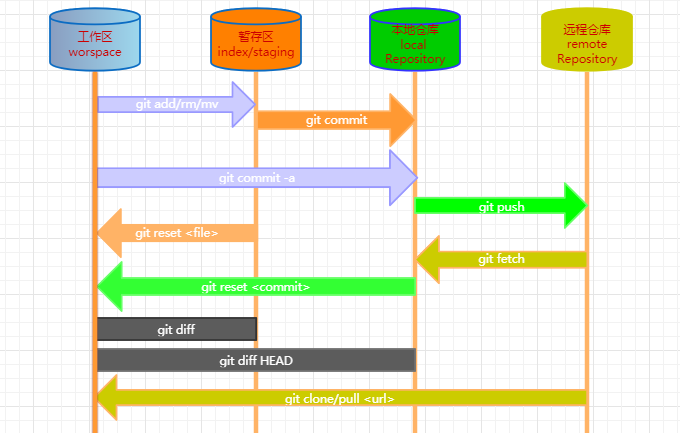

# 									Git讲义1.1

​                                                                               **版本信息**

| 版本  |  作者  |    时间    |   备注   |
| :---: | :----: | :--------: | :------: |
| V 1.0 | 林艺斌 | 2020/01/10 | 创建文件 |
|       |        |            |          |

> 在学习完一门课程、一个技术、一款软件之后；如果没有及时使用，过段时间基本遗忘，脑海里只会留下一些模糊的概念，所以学习总结、问题留下文档至关重要。
>
> 本文档不作为从0开始的Git教程，而是作为学习、使用总结文档，以便查阅。

# 1 版本管理

**1、什么是版本管理**

版本管理就是对文件修改的管理。当修改某个重要文件的时候，事先会先将原文件备份再进行修改；随着时间的推移你的备份文件越来越多。最后导致的结果可能是内容一片混乱，文件也一片混乱。

有效的版本管理可以解决上面的问题。

**2、Git vs SVN**

借助优秀的版本管理工具可以提高版本管理的效率，和速度。

Git和SVN就是两个优秀的版本管理工具，他们在管理文件版本的方法上不同。

- Git  ：分布式版本管理工具
- SVN：集中式的版本管理工具

# 2 Git概述

**1、什么是Git**

 Git是Linus使用C语言编写的一个分布式版本管理软件，可用于对代码、文件等实现版本管理。

**2、Git核心概念**

Git的三个重要的设计，后面的文件版本管理工作都是在这三个地方完成的

- 工作区（workspace）：我们存放需要进行版本管理文件的电脑目录。
- 暂存区（index）         ：类似与缓冲区，临时保存文件改动。
- 仓库区（Repository)   ：最终保存文件改动的地方。（有本地仓库和远程仓库之分）

**3、Git提交代码的步骤**

1. git add将文件提交到暂存区。
2. git commit将代码从暂存区提交到本地仓库。
3. git push将代码从本地库提交到远程库

**4、git命令图解（图片参考网络）**

熟悉Git工作命令之后再回来看下图

**5、注意事项**

后面Git文档中会出现很多Git命令，如：`$ git config --global user.name "xiaoming"`这边`$`表示终端的意思，是不需要输入的内容。`git config --global user.name "xiaoming"`才是命令的内容。

后面不再对此做出解释。

# 3 Git安装

## 3.1 windows安装Git

**1、Git下载**

- 访问Git网址选择windows版本下载

  > Git官网：https://git-scm.com/downloads/

**2、Git安装**

- 默认安装即可。
- 安装结束，在windos开始找到`Git Bash`软件

# 4 Git配置

**1、Git必要配置**

Git是分布式，所以需要设置配置邮箱地址与姓名作为标识，后面提交文件的时候会看到。

打开`Git Bash`配置邮箱和姓名

- 配置姓名：`$ git config --global user.name "name"`

  > 如：`$ git config --global user.name "xiaoming"`

- 配置邮箱：`$ git config --global user.email "email address"`

  > 如：`$ git config --global user.name "2xxxxxxx9@qq.com"`

命令当中的`--global`是参数， 表示你这台机器上所有的Git仓库都会使用这个配置（全局有效） ，如果你只想你的配置对当前Git仓库有效可以将`--global`改为`--local`。

**2、Git非必要配置**

Git可以做一些其他配置，如命令别名、颜色等。但这些是非必要设置，可等熟悉Git命令后再配置

- 配置颜色：使Git命令`输出`的某些内容显示不同颜色

  > `$ git config --global color.ui true`

- 配置别名：用较为简单的字符代替较长命令。

  > `$ git config --global alias.co checkout`
  > `$ git config --global alias.ci commit`
  > `$ git config --global alias.st status`
  > `$ git config --global alias.br branch`

  配置完成后，凡是需要使用`checout`都可以使用`co`字符代替，效果一样！！！

**3、当前配置查看**

查看Git当前所有的配置：`$ git config -l `

# 5 Git基础

**1、Git仓库**

Git仓库也就是用于实现文件版本管理的容器，需要使用Git来进行创建。

创建完Git仓库之后就可以Git各种命令实现`添加`、`提交`、`撤销`、`回退`、等一系列的版本管理操作了。

**2、文件管理**

在创建Git仓库之前需再稍微提一下Git的三个核心区域

- 工作区（workspace）：我们存放需要进行版本管理文件的电脑目录。
- 暂存区（index）         ：类似与缓冲区，临时保存文件改动。
- 仓库区（Repository)   ：最终保存文件改动的地方。（有本地仓库和远程仓库之分）

**3、Git使用的简要描述**

工作区存放的是文件；修改、新建、删除文件都是在`工作区`中完成。当你完成某些操作，并确定`暂时`或`短时间`不再做修改文件，就可将`工作区`推送到`暂存区`，然后提交到`Git仓库`。

此时`Git仓库`里存放就是当前文件版本，如果你需要对文件再进行操作，操作完一样推送到暂存区，然后提交到`Git仓库`，Git会将你提交的版本都记录下来。

当你修改完文件发现修改有误，想回到修改之前版本，可以使用命令把`工作区`版本回退到`Git仓库`存放的版本即可。

如果是多人协作的项目，当你把你的项目修改完成提交到`本地仓库`之后，使用Git命令将`本地仓库`推送到`远程仓库`，你的伙伴就能从远程仓库克隆你的版本进行修改。

## 5.1 Git仓库创建

**1、Git创建仓库有三种方式：**

下面三种方式都能创建Git仓库，根据实际情况选择一种使用即可

- 将当`前目录`作为Git本地仓库使用：`$ git init`

- `创建新目录`，当作Git本地仓库使用：`$ git init 目录名`

- 将`克隆远程仓库`作为Git本地仓库使用：`$ git clone 项目地址`

**2、实例**

以GitTestDir为项目目录，创建一个Git仓库

> `$ git init GitTestDir`

可以先简单的理解为GitTestDir即使`工作区`也是`暂存区`还是`Git仓库`。

创建、修改、删除文件，都在这个目录下操作，操作完成后使用Git命令提交当前文件到Git仓库（即保存当前版本）。

## 5.2 Git基本操作

文件在`工作区`操作完成都要先提交到`暂存区`，最后再提交到`Git仓库`

**1、新增删除文件**

新增文件到暂存区

- 添加指定文件到暂存区：

  > `$ git add 文件1 文件2 ...`

- 添加当前目录的所有文件到暂存区：

  > `$ git add .`

- 添加指定目录到暂存区，包括其子目录：

  > `$ git add <dir>`

删除文件

- 删除工作区文件，并且将这次删除放入暂存区：

  > `$ git rm 文件1 文件2 ...`

- 停止追踪指定文件，但该文件会保留在工作区：

  > `$ git rm --cached 文件1`

-  改名文件，并且将这个改名放入暂存区 

  >  `$ git mv 原名 修改名 `

  

**2、文件提交**

这里的提交指的是讲改动提交到`Git仓库`

-  提交暂存区到仓库区

  > ` $ git commit -m "描述信息：如新增了xx文件" `

-  提交暂存区的指定文件到仓库区 

  > ` $ git commit 文件1 文件2 ... -m "描述信息：如新增了xx文件"` 

  文件可以多次添加到`暂存区`再统一提交到`仓库区`

-  提交`工作区`自上次commit之后的变化，`直接到仓库区` 

  > ` $ git commit -a `

# 6 Git远程

# 7 Git分支

# 8 Git标签

# 9 Git忽略

# 10 搭建Git服务器

# 11 GitGUI

# 12 码云（国内托管网站）

# 13 Git快速查询

1 Git命令

2 Git问题